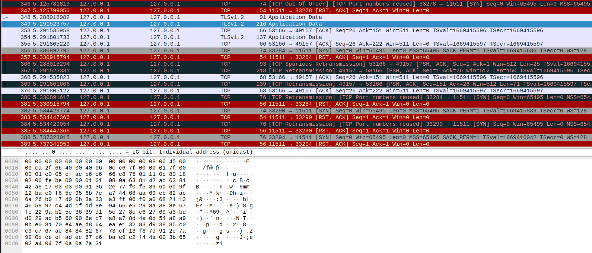

# Lab work <mark>Remote shell</mark>
Authors (team):<br>
Yurii Zinchuk[https://github.com/yurii-zinchuk],<br>
Liliana Hotsko[https://github.com/NaniiiGock],<br>
Anna Polova[https://github.com/Annnnya]

## Prerequisites
G++, CMAKE, BOOST, readline, openssl. Also, you may find dependencies in `./dependencies` folder.<br>

To get `readline` lib on Ubuntu, use:
```bash
sudo apt-get install libreadline-dev
```

To get `openssl` lib on Ubuntu, use:
```bash
sudo apt-get install libssl-dev
```

### Compilation

To compile the project, use either 

```bash
$ ./compile.sh
```

or utilize any IDE's build tool using CMake.


### Usage


#### Deafult mode

The program `myshell` is used from cmd. It acts like a shell (command interpreter). It takes as its input various types of arguments: own scripts marked with `.msh`, inbuilt programs which it executes in current process, outher programs (executables) wich it executes in a child process. `myshell`'s behaviour is based on the arguments passed to it.

To use `myshell`, first build the project as described in `Compilation` part, then:
```bash
$ <path-to-executable>/myshell
```
, where<br>
<path-to-executable> is path to the directory where `myshell` executable is located.<br>

This will open the shell itself and you will be able to execute this shell's own commands directly form the cmd prompt:
```bash
$ mecho Hello, world!
```
Another way is to pass `.msh` scripts to `myshell` from outside the interpreter (for instance, being in bash interpreter at that moment):
```bash
$ ./myshell script.msh
```
This will run `sript.msh` without opning `myshell` as an interpreter, just use it to run the script and finish.

Also, `myshell` supports all sorts of operations listed in the assignment, for example manipulating enviorment variables and substitiuting them:
```bash
$ mexport VAR hello
$ mecho $VAR
hello
$ 
```

#### Server mode

You can launch shell in server mode bu writing
```bash
$ ./myshell --server --port 49157
```
If port is not specified, default is 8080

In server mode many clients can connect, therefore the commands are not displayed in server terminal. The output is directly sent to cliens and the command itself is logged in file logs.txt.

### !!! As there is security level implemented, usual telnet does not work for connecting as a client. For client connection please use:

```bash
$ openssl s_client -connect 127.0.0.1:49157
```


# Additional tasks
<mark> TSL protocol for data encryption <mark>

In sever mode communication between server and client is protected via TSL protocol using openssl library for C++.

The server's public and private keys are taken from tsl_keys folder. As this is study project, they are on GitHub with all the code, but if you want to use this examle for something more, please regenerate them by writing:

```bash
$ openssl req -newkey rsa:2048 -new -nodes -x509 -days 3650 -keyout key.pem -out cert.pem
```

The encryption really works and this was checked with wireshark:




